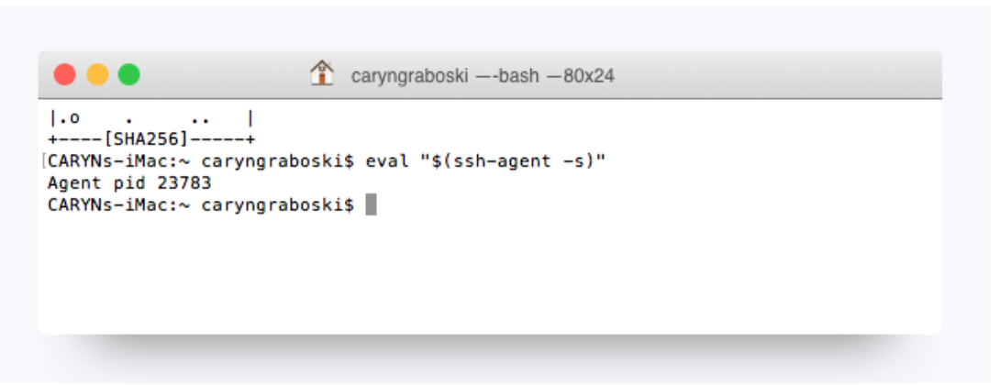
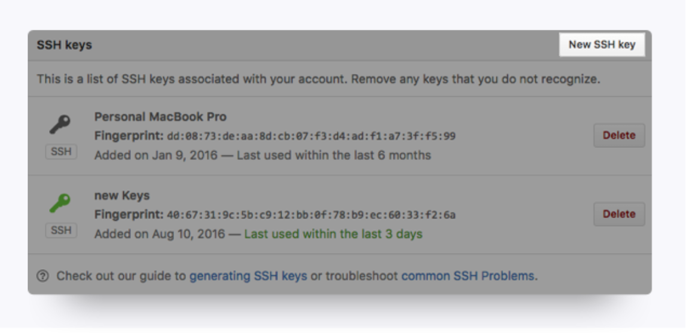

## Adding SSH Key

SSH Key

Generating SSH keys allows developers to interface with certain remote services without having to constantly type out login information. You're going to set up an SSH key for GitHub.

Without a key, you won’t be able to push your code to GitHub without entering a password each time; trust us, that would be as irritating as needing a key to open every door in your home.

1. Sign up for an account on https://github.com.

2. Open up Terminal.

3. We need to set up SSH keys. First, let’s make sure you don’t already have a set of keys on your computer. Type this into your Terminal window (copying and pasting will not work)

```ls -al ~/.ssh```

If no keys pop up, move on to step 4.

If keys do pop up, check that none of them are listed under id_rsa, like in this image:


If you do find a key with a matching name, then you can either overwrite it by following steps 4 to 6, or you can use the same key in steps 10 and beyond. Be advised that you'll have to remember the password tied to your key if you decide not to overwrite it.

4. Type in this command along with your email to generate your keys:

  ```ssh-keygen -t rsa -b 4096 -C "YOURGITHUBEMAIL@PLACEHOLDER.NET"```

5. When asked to enter a file to save the key, just hit return.

* Also enter a passphrase for your key.

* Note: You shouldn’t see any characters appear in the window while typing the password.

6. When you’re finished, your window should look like this: 


7. For the next step, we need to use a tool called an ssh agent. Let’s test whether that’s working on your machine. Run this command in Terminal:

* ```eval "$(ssh-agent –s)"```

* If your Terminal window looks like the image below, move onto the next step.

* If this did not work, ignore it for now.



8. Now run this command:

* ```ssh-add ~/.ssh/id_rsa```

9. When prompted for a passphrase, enter the one associated with the key.

* If you’ve forgotten this key, just go through step 4 to create a new one.

10. We need to add the key to GitHub. Copy the key to your clipboard by entering this command:

* For Mac Users:
  * ```pbcopy < ~/.ssh/id_rsa.pub```

* For Windows Users: 
  * ```clip < ~/.ssh/id_rsa.pub``` 
* If your running linux, you'll need to isntall xclip and then copy.
  * ```sudo apt-get install xclip```
  * ```xclip -sel clip < ~/.ssh/id_rsa.pub```

* You shouldn’t see any kind of message when you run this command. If you do, make sure you entered it correctly.

* Do not copy anything else until you finish the next steps. Otherwise, you’ll have to enter the copy command again.

11. Go to https://GitHub.com/settings/ssh. Click the “New SSH key button.”




12. When the form pops up, enter a name for your computer in the Title input. In the Key input, paste the SSH key you copied in Step 10.


* Ignore step 13 if your SSH Agent didn't work (Step 7)

13. Now we just need to add GitHub to your computer’s list of acceptable SSH hosts. Go back to your Terminal window. Type in this command: ```ssh -T git@github.com```

* You should see an RSA fingerprint in your window. Only enter “yes” If it matches the one highlighted in the image below:


14. You may now need to change the git settings to use SSH instead of url as it usually is done.

* run ```git remote set-url origin git@github.com:USERNAME/REPOSITORY.git```
